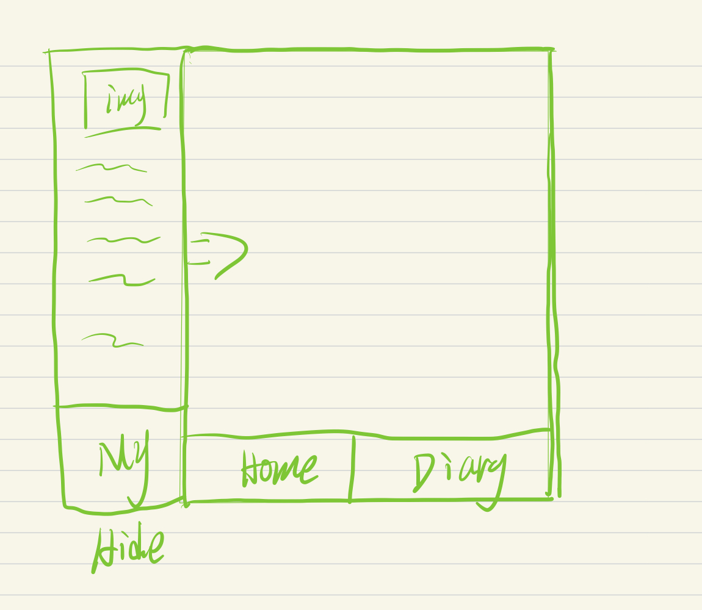

# YuWeiFlutterApp

## 创建时间 2020-12-21

- component : 组件文件见

- data : 静态渲染数据
    - color : 颜色文件
    
- models : 模型数据

- util : 工具类
    
    
- widget : 散装组件

### 创建文件夹

- Home 主页 具体组件放在这个位置上。
- Diary 日记 经验总结
- My 我的 设置个人信息栏

草图如下：

打包